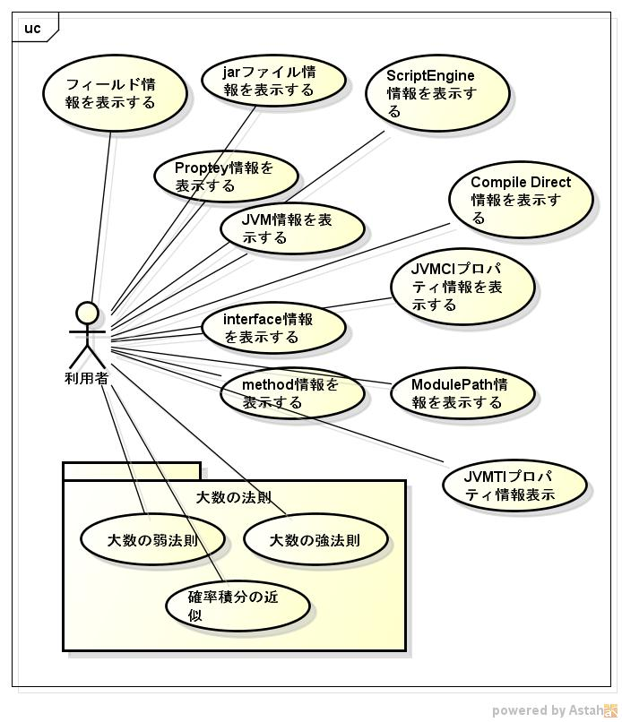

javatool
========
c言語からJNIライブラリを使用したツールです。

## Description ##
クラス図などのUMLは、  
https://github.com/siranovel/javatool/wiki

### ツールの種類 ###

## Demo ##

## VS. ##

## Requirement ##
java11対応

## Usage ##
* dspfields  
  $ dspfields フルクラス名
* dspjarfileinfo  
  $ dspjarfileinfo jarファイル名
* dspmethods  
  $ dspmethods フルクラス名
* dsppropinfo  
  $ dsppropinfo
* dspScriptEngine  
  $ dspScriptEngine
* dspmodinfo  
  $ dspmodinfo フルクラス名
* dspjvmflags  
  $ dspjvmflags

## install ##
    git clone https://github.com/siranovel/javatool.git  
    cd javatool  
    rpm -ivh <rpmファイル名>  

## Contribution ##

## Licence ##

## Author ##
